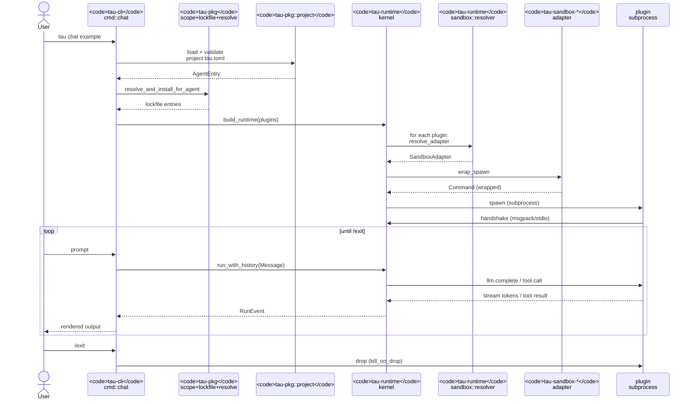
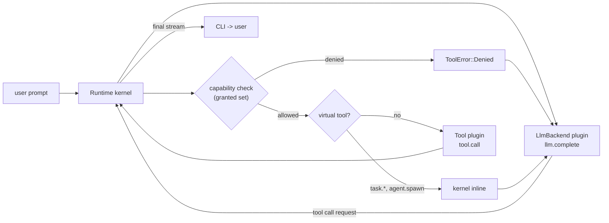
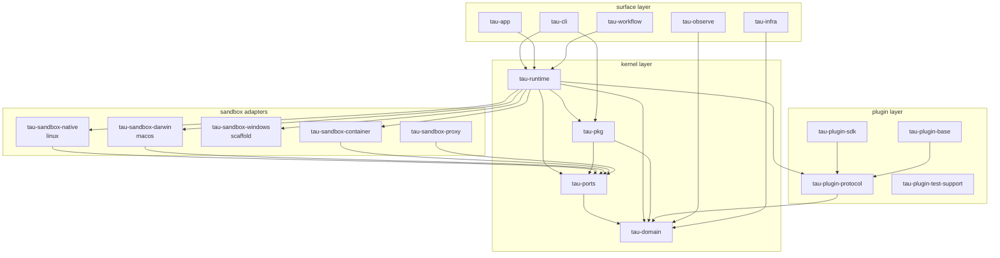

# Architecture overview

This page traces a single `tau chat <agent-id>` invocation end-to-end
through the codebase so a contributor can build a mental map of where
each crate lives in the request path. The pieces are documented in
isolation across the ADRs; this page stitches them together.

For the user-facing models, read [Packages](packages.md),
[Capabilities and consent](capabilities-and-consent.md), and
[Sandboxing](sandboxing.md). For an inventory of every crate, see
the [Crate map](crate-map.md).

## The path of a `tau chat`

Five logical phases, mapped to the crate that owns each:

| Phase | Owner crate | Key types / functions |
|---|---|---|
| 1. Argument parsing + dispatch | `tau-cli` | `cli::Command::Chat`, `cmd::chat::run` |
| 2. Project + lockfile load | `tau-pkg` | `read_manifest`, `Scope::resolve`, `Lockfile`, `tau_pkg::project::ProjectConfig` |
| 3. Capability resolve + sandbox plan | `tau-runtime` | `compute_effective`, `SandboxPlan`, `resolve_adapter` |
| 4. Plugin spawn (sandboxed) | `tau-sandbox-*` + `tau-runtime::plugin_host` | `Sandbox::wrap_spawn`, `PluginHostOptions`, `load_llm_backend` / `load_tool` |
| 5. REPL + run loop | `tau-runtime` + `tau-cli` | `Runtime::run_with_history`, `RunEvent`, REPL via rustyline |

## How a tool call flows

Once plugins are spawned and the REPL is up, a single prompt that
provokes a tool call hits the following path:

Three things to notice:

- **The kernel never lets a tool call reach the plugin without a
  capability check.** Even before any wire goes out, `kernel::dispatch`
  checks the agent's `granted_capabilities` against the tool method's
  required capability. ADR-0014 §"capability check" pins this.
- **Virtual tools short-circuit before plugin dispatch.** `task.*`,
  `agent.<kind>.spawn`, and `run.*` are intercepted by the kernel
  inline — same shape as ordinary tool calls from the agent's LLM
  view, but no plugin process is involved. ADR-0024 §"verb classes".
- **The Layer 4 sandbox is the backstop**, not the gate. By the time
  the kernel calls into a plugin, capability filtering has already
  happened in-process; the sandbox is there to catch the case where
  the plugin binary tries to bypass the wire contract.

## Crate dependency at a glance

The four layers reflect tau's hexagonal posture:

- **kernel** — the canonical data types (`tau-domain`), the ports
  (`tau-ports`), the runtime that drives them (`tau-runtime`), and
  the package manager (`tau-pkg`). Stable public surfaces (G6).
- **plugin** — the wire protocol (`tau-plugin-protocol`), the
  base library plugins link against (`tau-plugin-base`), the
  authoring SDK (`tau-plugin-sdk`), the test fixtures
  (`tau-plugin-test-support`).
- **sandbox adapters** — per-target implementations of the
  `Sandbox` port. New backends land additively.
- **surface** — what end users see: the CLI binary, the app
  runner, the workflow engine, observability glue, infra.

[Crate map](crate-map.md) describes every crate in detail.

## Where to look when…

A contributor-oriented quick map:

- **"My new tool capability won't grant."** Walk `tau-runtime::
  kernel::capability_check`, then the resolver in `sandbox::
  resolver`, then the adapter's `wrap_spawn`.
- **"My plugin's handshake fails."** Plugin-side: `tau-plugin-base`
  message loop, `tau-plugin-protocol::handshake`. Kernel-side:
  `tau-runtime::plugin_host::handshake_with_options`.
- **"My install fails at cross-check."** `tau-pkg::install` step 8.7
  + `tau-runtime::plugin_host::describe_capabilities` (ADR-0016
  Decision 1).
- **"My sandbox plan resolves to passthrough unexpectedly."**
  `tau-runtime::sandbox::resolver::resolve_adapter`. Run with
  `TAU_LOG=tau_runtime::sandbox::resolver=debug` to see probe
  results.
- **"My workflow step doesn't see the previous step's output."**
  `tau-workflow::engine` template rendering; check the JSONL at
  `<scope>/.tau/workflows/runs/<run-id>.jsonl`.

## See also

- [Crate map](crate-map.md) — every crate with one-line purpose.
- [Packages](packages.md) — the install model the runtime serves.
- [Sandboxing](sandboxing.md) — the four-layer enforcement model.
- [Multi-agent orchestration](multi-agent-orchestration.md) — what
  the kernel does once `agent.<kind>.spawn` fires.
- [Testing strategy](testing-strategy.md) — where tests live for
  each phase of the path above.
- [ADR-0008](../decisions/0008-plugin-loading.md) — the plugin
  protocol + handshake the spawn step uses.
- [ADR-0006](../decisions/0006-tau-runtime.md) — `tau-runtime`'s
  original design contract.
