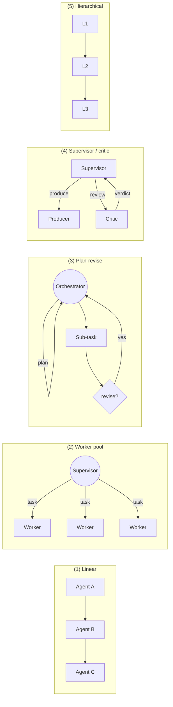

# Multi-agent orchestration

> "Tau runs agents solo or orchestrated, without special cases."
>
> — *Constitution* G9

A solo agent is an agent running without a pipeline; an orchestrated
flow is several agents coordinating. Tau uses **the same kernel
machinery for both**. This page explains the orchestration primitives
the runtime ships — what an agent can spawn, how children coordinate
without a message bus, what guarantees hold across a multi-agent run,
and where the model deliberately stops.

If you haven't already, read [Packages](packages.md),
[Capabilities and consent](capabilities-and-consent.md), and
[Sandboxing](sandboxing.md) first. Orchestration is what the
package model enables once the capability + isolation layers are in
place.

## The shape of an orchestrated run

The kernel models six entities:

| Entity | What it is |
|---|---|
| **Identity** | a stable handle for an agent inside a run (parent / child / sibling references). |
| **Capability** | a typed grant (see [capabilities-and-consent](capabilities-and-consent.md)). |
| **Agent** | a configured `(package, llm_backend, system_prompt, grant)` tuple. |
| **Task** | a unit of work with a hierarchical id (`1`, `1.1`, `1.1.a`) and a lock (owner + lease + heartbeat). |
| **TraceEvent** | an append-only record of what happened — emitted by the host, never written by an agent directly. |
| **Run** | the root container: a tree of agents, a shared task list, a JSONL trace log. |

And three **channels** through which agents observe each other:

- **Sync return** — when agent A calls a virtual tool that spawns
  agent B, A blocks on B's final message. The return value is
  whatever B emits as its completion.
- **Shared state** — the run's `TaskList` is a single tree any agent
  with `Capability::TaskList { mode = "read"|"write"|"manage" }`
  can claim, complete, or annotate.
- **Trace** — every agent step (think / tool call / completion)
  appends to `<scope>/.tau/runs/<run-id>.jsonl`. Agents can *read*
  the trace if granted; they cannot *push* into another agent's LLM
  context.

What is deliberately absent: a message bus, an inbox stack, a
publish-subscribe primitive, or any way to inject a message into
another agent's LLM context unsolicited. ADR-0024 rejected all four
— they break LLM coherence and pull the system toward a graph
topology when the design intent is a *tree*.

## The five patterns the kernel composes

Every named orchestration pattern in literature (CrewAI, AutoGen,
LangGraph, Swarm) collapses to one of five tree shapes the kernel
primitives compose without special-casing:

- **Linear** — A → B → C. Same primitive as the
  [tau-workflow](#see-also) runner, just inside one run instead of
  driven by an external script.
- **Worker pool** — a supervisor agent pre-populates the task list;
  worker agents (same kind, parallel) each `task.claim()` →
  `task.complete()`. Coordination is the shared list, not RPC
  between workers.
- **Plan-revise** — an orchestrator writes a plan into the task
  list, executes one step (often as a sub-task spawned via
  `agent.<kind>.spawn`), reads the trace, revises the plan, repeats.
- **Supervisor / critic** — supervisor spawns a producer agent and
  a critic agent; the critic reads the producer's output (sync
  return), emits a verdict, supervisor accepts or re-spawns.
- **Hierarchical** — agents recursively spawn deeper sub-agents.
  Each level can have its own capability grant (always a subset of
  the level above).

All five share one kernel: no scheduler, no bus, no DAG executor —
just `agent.<kind>.spawn` (virtual tool, recursive into
`Runtime::run`), `task.*` (virtual tool family for the shared list),
and `run.*` (read-only introspection).

## Virtual tools, not magic

The orchestration verbs are **virtual tools** intercepted by the
kernel before plugin dispatch:

| Virtual tool | What it does |
|---|---|
| `task.list` | enumerate task tree. |
| `task.add` | append a sub-task. |
| `task.claim` | acquire the lock on a task (lease + heartbeat). |
| `task.complete` | release lock + record result. |
| `task.update` | annotate (description, metadata). |
| `agent.<kind>.spawn` | recursively invoke `Runtime::run_with_history` with a child grant ⊆ parent grant. |
| `run.snapshot` | read-only snapshot of the run state. |

They look exactly like ordinary tool calls in the agent's LLM
context — same shape, same JSON schema — but the kernel handles
them inline rather than dispatching to a plugin. The agent doesn't
need to know they're virtual; from its perspective tools are tools.

This is the trick that keeps the model coherent. There is no
separate "orchestration API" with its own auth / state / failure
modes; orchestration is built from the same capability-checked
tool-call surface every plugin uses. ADR-0024 §"verb classes" walks
through the alternatives that were rejected.

## The six invariants

Every multi-agent run holds six invariants. They are the *only*
things the kernel guarantees; everything else is the agent author's
problem.

1. **Capability subset.** A child agent's grant is always a subset
   of the parent's. Verified at `agent.<kind>.spawn` time by
   `check_capability_subset`; spawn fails otherwise.
2. **Lock exclusivity.** A task with a live lock cannot be claimed
   by another agent until the lease expires or the owner completes.
3. **LLM-context immutability.** No agent's LLM context is mutated
   by another agent. Inter-agent observation is read-only (shared
   list + trace).
4. **Trace monotonicity.** The JSONL trace is append-only with
   monotonic event ids. No retro-edits, no re-orderings.
5. **Run termination.** Every run ends — either by every spawned
   agent reaching completion or by the run-level budget firing.
6. **Budget enforcement.** Run-level token / wall-clock / spawn-depth
   caps are checked at every kernel transition; exceeding any one
   forces a clean termination with the partial state recorded.

The invariants together mean an orchestration's failure modes are
*observable* (in the trace) and *bounded* (by the budget). You can
debug a multi-agent run the same way you debug a single-agent run —
read the trace and replay.

## What sandboxing means in a multi-agent run

Each spawned child runs under its **own** sandbox plan, derived from
its own package manifest + the parent's grant. The capability
subset law (invariant 1) means a child never *gains* capabilities by
being spawned — only by being granted them at install time (via the
child package's own `tau.toml`) AND being granted them via the
parent's `agent.<kind>.spawn` payload.

This composes the [four enforcement
layers](sandboxing.md#the-four-layer-enforcement-model) recursively:
manifest declaration → install-time cross-check → pre-flight
resolution → kernel enforcement, *per spawn*.

A child that needs `net.http` to `api.example.com` while the parent
holds `net.http` to `*` is permitted (subset). A child that needs
`fs.write` while the parent holds only `fs.read` is rejected — the
parent cannot grant what it does not hold itself.

## What this rules out

The model is opinionated. Several patterns common in other
multi-agent systems are *not* representable on v1:

- **Push-style messaging.** No `agent.send(other_id, payload)`. If
  agent A wants to inform agent B of something, A writes to the
  shared task list and B reads it (or B is spawned with the relevant
  context in its system prompt).
- **Background monitors.** No long-lived "watch this and tell me
  when X" agents. The Anthropic-style Monitor primitive is a
  separate entity class (Channel D + BackgroundTool) deferred to a
  follow-up.
- **Graph topologies / DAG execution.** Tree only. Plan-revise can
  *iterate*, but each iteration is a fresh sub-task in the linear
  tree — not a parallel-DAG edge.
- **Output schemas / typed returns.** Sync-return is `Message` →
  `Message`; the kernel doesn't enforce that B's reply matches a
  caller-declared schema. Validation is the caller's job. Phase 2
  hardening.
- **Cross-run memory.** Each run is a fresh tree with its own
  trace. Persistence across runs is the package author's problem
  (e.g., a `storage` plugin).

These are explicit non-goals in ADR-0024, not unshipped features.
Reach for an orchestration package (pipeline `kind`) if you need
something different — tau core's commitment is the primitive set,
not every possible pattern.

## What v1 ships vs. v1.1

- **v1 (PR #59).** The full primitive set + three patterns
  end-to-end: linear, worker-pool, plan-revise. `agent.<kind>.spawn`
  was validated but returned a documented `is_error: true` instead
  of recursively invoking the runtime.
- **v1.1 (PR #60).** `agent.<kind>.spawn` recursively invokes
  `Runtime::run_with_history`, unblocking supervisor/critic and
  hierarchical. All five patterns now compose.

Live trace rendering during a run is still CLI-summary-only; the
JSONL log under `<scope>/.tau/runs/<run-id>.jsonl` is the
replay-and-inspect source of truth. Wiring streaming output is
tracked as a follow-up.

## See also

- [Packages](packages.md) — orchestration packages have
  `kind = "pipeline"` (G2 + NG5).
- [Capabilities and consent](capabilities-and-consent.md) — the
  subset law (invariant 1) is the capability model recursively.
- [Sandboxing](sandboxing.md) — every spawned child enforces the
  four-layer model under its own plan.
- [Bootstrap a tau project](../tutorials/bootstrap-a-tau-project.md)
  — the agent loop a single-agent run executes; orchestration is
  this loop recursed.
- [`CONSTITUTION.md`](../../CONSTITUTION.md) G9, G10 — the
  guidelines this model fulfils.
- [ADR-0024](../decisions/0024-multi-agent-orchestration.md) — the
  full design rationale, alternatives considered, and the six
  invariants.
- `tau-workflow` (ADR-0022) — the older linear pipeline runner.
  Workflows are external-script-driven; orchestration is
  in-run-driven. Same composition primitives underneath.
