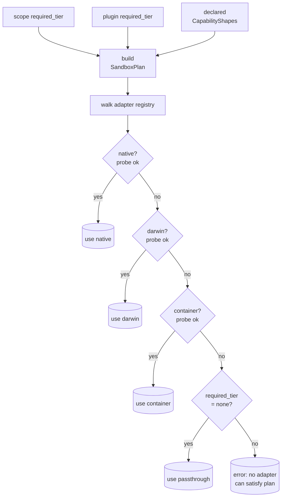
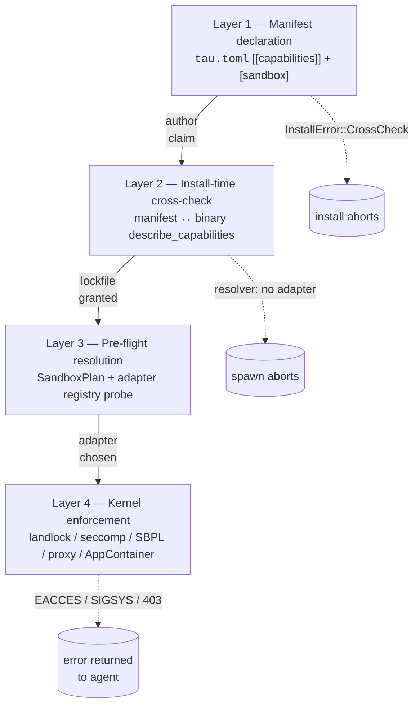

# Sandboxing

> "Security is consent-based with sandboxing enforcement."
>
> — *Constitution* G12

A plugin is somebody else's code. Even with the best manifest review
in the world, the kernel layer is the only one that can answer "is
this binary actually constrained to its declared capabilities?" tau's
sandboxing model is the answer: every plugin spawn flows through an
OS-level sandbox adapter that enforces the capability set the
manifest declared at install time.

This page explains the model — why tau sandboxes, the tier vocabulary,
how an adapter is picked per platform, where the enforcement lives in
the install → run lifecycle, and what the sandbox is *not* designed
to do. Pages elsewhere — [Packages](packages.md), [Escape
hatches](escape-hatches.md), the [sandbox platform
support](../reference/sandbox-platform-support.md) reference — assume
you have read this one.

## What problem this solves

The kernel runtime already checks capabilities — an agent asking a
tool for `fs.write` against a path outside its grant returns an error
before the tool plugin is even called. That check is correct, but it
runs *inside* the tau process. A misbehaving or compromised plugin
binary could ignore the wire-level capability boundary and just call
`open(2)` directly on whatever it wants. ADR-0014 names this the
"Layer 4" gap: in-process gates are necessary but not sufficient;
the kernel must back them up.

The sandbox adapter closes the gap by spawning every plugin process
inside an OS-level isolation primitive (landlock, sandbox-exec,
AppContainer, container runtime) whose rules are derived from the
exact same `Capability` set the manifest declared. The runtime path
and the kernel path see the same grant, by construction.

## The tier vocabulary

Three tiers, listed weakest first. They are *intent levels*, not
mechanism choices — picking a tier says what isolation you want, not
which adapter delivers it.

| Tier | What it asks for | When to use |
|---|---|---|
| `none` | No isolation. Plugin runs in tau's user; only the in-process capability check applies. | Toy plugins, the explicit `--no-sandbox` escape hatch, environments where the kernel primitives genuinely aren't available. |
| `light` | Filesystem narrowing. Plugin can only read/write paths derived from its declared `fs.read` / `fs.write` capabilities. No syscall filtering, no network containment beyond the host's defaults. | Tool plugins that touch the filesystem but don't otherwise need hardening (text processors, file scanners). |
| `strict` | Filesystem narrowing **plus** syscall allow-listing **plus** network containment **plus** per-command exec gating. The full defence-in-depth stack. | Anything that handles untrusted input, talks to a network, spawns subprocesses, or calls an external API. All five shipped real plugins (`anthropic`, `ollama`, `openai`, `fs-read`, `shell`) declare strict. |

Sandboxing is **on by default**. A project with no `[sandbox]` block
in `<scope>/config.toml` resolves to `required_tier = "strict"`
(ADR-0015 Decision 1). Opting out is explicit and visible — never
silent fall-through. The two escape hatches:

```toml
# Per scope (~/.tau/config.toml or <project>/.tau/config.toml)
[sandbox]
required_tier = "none"
```

```bash
# Per invocation
tau run --no-sandbox <agent>
```

Both route to the `passthrough` adapter — registered as a first-class
adapter, not as a sentinel — so the operator always knows which
adapter is in play. Light tier is selected by a plugin or scope
declaring `required_tier = "light"`.

## Adapters: how a tier becomes enforcement

A `SandboxAdapter` is a `tau-ports::Sandbox` implementation that
turns a `SandboxPlan` (tier + capability shapes) into a wrapped
`Command` ready to spawn. Today's adapters:

| Adapter | Crate | Mechanism |
|---|---|---|
| `native` (Linux) | `tau-sandbox-native` | landlock V1 (filesystem) + seccomp BPF (syscalls) + user / network namespaces + per-command exec gating via `AccessFs::Execute`. |
| `darwin` (macOS) | `tau-sandbox-darwin` | `sandbox-exec` with a generated SBPL profile; strict tier only (SBPL has no clean light-tier subset). |
| `windows` (scaffold) | `tau-sandbox-windows` | AppContainer SID + `CreateProcessAsUserW`. Phase 1 is stub-only — probes `Unavailable` — full implementation deferred (ADR-0023). |
| `container` | `tau-sandbox-container` | Per-plugin Docker / Podman image built on a shared `tau-plugin-base`. Cross-platform fallback. |
| `passthrough` | `tau-runtime::sandbox::passthrough` | Identity wrap. The explicit "no sandbox" path. |

Strict tier on Linux and macOS also gets a **userspace HTTPS proxy**
(`tau-sandbox-proxy`, ADR-0020). The plugin runs in an empty network
namespace; its `HTTPS_PROXY` env points at a Unix-socket bridge that
the parent address space accepts CONNECTs on. The proxy validates
the SNI hostname against the plugin's declared `net.http` capability
hosts before relaying. This replaced an earlier veth + nftables
machinery (ADR-0019, now superseded) and dropped the `CAP_NET_ADMIN`
requirement so CI runs on stock `ubuntu-latest`.

### Resolution

A static `AdapterRegistration` slice in `tau-runtime::sandbox::resolver`
lists every adapter built on the current target with the tiers and
capability *shapes* it can satisfy. At spawn time the resolver:



The user never writes "fall back to X then Y" priority chains.
Declarative requirements + registry probe + resolver. Bazel
toolchains is the closest analogue (ADR-0015 §1 records why the
chain model was rejected).

## The four-layer enforcement model

Sandboxing is not one step; it is four. Each layer catches a
different class of mismatch.



Each layer catches a different class of mismatch:

**Layer 1 — Manifest declaration.** The package's `tau.toml` carries
a `[sandbox] required_tier` plus a `[[capabilities]]` block.
This is what the package author claims it needs (ADR-0002 + ADR-0016
amendment).

**Layer 2 — Install-time cross-check.** `tau install` spawns the
binary, runs `meta.handshake`, and (for tool-port plugins) calls
`tool.describe_capabilities` per method. The aggregated set is
compared against the manifest bidirectionally: binary-claims-extra
and manifest-declares-unused both fail. Drift aborts install with
`InstallError::CrossCheck` (ADR-0016 Decision 1).

**Layer 3 — Pre-flight resolution.** Before any spawn, the resolver
builds the `SandboxPlan` and probes adapters. Failure here means
"the host can't satisfy what was promised at install" — the user
sees a guided diagnostic instead of a half-isolated child process
(ADR-0015 Decision 3).

**Layer 4 — Kernel enforcement.** The adapter wraps the
`Command` and the kernel does the work. landlock returns EACCES on a
disallowed `open(2)`. seccomp `SIGSYS`-kills the process on a
disallowed syscall. The proxy refuses a CONNECT to a host outside the
declared `net.http` set. AppContainer denies token access to
unallowed objects.

Layer 4 is the only layer the plugin author cannot accidentally
bypass; the other three are paper rules backed by it.

## Consent at install time

Layers 1–4 enforce what the manifest declared. Who decides what the
manifest is allowed to declare? The user, at install time (G14).

`tau install` prints the manifest's capability block before writing
the lockfile. The user sees `fs.read paths = [...]`, `net.http hosts
= [api.anthropic.com]`, `process.spawn commands = [git]` and accepts
or aborts. Granting later requires `tau install --force`, which
re-prompts — capabilities cannot escalate silently.

The granted set is recorded in the lockfile (ADR-0026). `tau verify`
checks the lockfile's content hashes against the installed package
to catch later tampering. Consent is captured at one point in time
and bound to a specific content hash; modifying the package on disk
fails verification.

## What sandboxing does not do

The sandbox enforces a *system-level* trust boundary. It is not a
guarantee about agent behaviour.

- **It is not an AI safety harness.** NG8 is explicit: sandboxing
  protects tau against misbehaving or malicious *packages*. It says
  nothing about agent output alignment, truthfulness, or ethics.
- **It is not a content firewall.** Strict tier prevents a plugin
  from exfiltrating to an unallowed host. It does not prevent the
  agent from being instructed (by an adversarial prompt) to ask an
  allowed tool to do something the operator dislikes.
- **It is not a CPU / memory / time limit.** The current adapters do
  not impose cgroups-style resource limits. A plugin that allocates
  forever or burns CPU does so freely. Future hardening — Phase 2 of
  ADR-0021 names cgroups + container-side limits as the natural
  layer for this.
- **It is not credential containment by itself.** Credentials are
  references in the agent context (G13); the sandbox is the
  backstop. The credential abstraction is what actually prevents
  raw keys from reaching plugin context.

## Lifecycle recap

A request to spawn an `@tau/anthropic` plugin under strict tier
flows through:

1. **Install** (one-time): manifest validated → binary
   cross-checked → user consents → lockfile written.
2. **Resolve** (per spawn): scope `required_tier` × plugin
   `required_tier` → `SandboxPlan` → adapter probed → adapter chosen
   (or guided failure).
3. **Wrap** (per spawn): adapter rewrites the `Command` — landlock
   ruleset bound, seccomp filter prepared, namespace flags set,
   proxy socket attached, env vars rewritten.
4. **Spawn**: child runs. Layer 4 kernel mechanisms enforce. Any
   capability mismatch surfaces as an error inside the child (EACCES,
   SIGSYS, proxy refusal) and propagates as a tool-call error to the
   agent.
5. **Teardown**: child exits, the temp profile / socket / netns is
   cleaned up; the proxy task drains and stops.

The runtime path and the kernel path agree by construction — both
derive from the same manifest-declared `Capability` set, intersected
with the scope's policy.

## See also

- [`CONSTITUTION.md`](../../CONSTITUTION.md) G12, G14, NG8 — the
  identity-level commitments this model fulfils.
- [Packages](packages.md) — the install-time consent step.
- [Escape hatches](escape-hatches.md) — the registry of every
  `Custom` / `InternalError` variant, including the sandbox
  passthrough adapter's place in it.
- [Sandbox platform support](../reference/sandbox-platform-support.md)
  — the kernel features the native adapter requires and the distros
  CI verifies.
- [ADR-0014](../decisions/0014-sandboxing.md) — the original
  hexagonal port + Linux native + container adapters.
- [ADR-0015](../decisions/0015-sandbox-activation.md) — declarative
  requirements + registry + resolver; sandbox on by default.
- [ADR-0016](../decisions/0016-plugin-compat-verification.md) —
  Layer 2 install-time cross-check.
- [ADR-0017](../decisions/0017-e2e-landlock-and-driver.md) —
  end-to-end kernel verification + port-aware Layer 4 driver.
- [ADR-0019](../decisions/0019-per-host-network-filter.md) (historical) →
  [ADR-0020](../decisions/0020-sandbox-proxy.md) — why the userspace
  proxy replaced the earlier veth + nftables machinery.
- [ADR-0021](../decisions/0021-per-plugin-images.md) — per-plugin
  container images.
- [ADR-0022](../decisions/0022-sandbox-darwin.md) — macOS adapter via
  `sandbox-exec`.
- [ADR-0023](../decisions/0023-sandbox-windows-scaffold.md) — Windows
  AppContainer scaffold; Phase 2 deferred.
