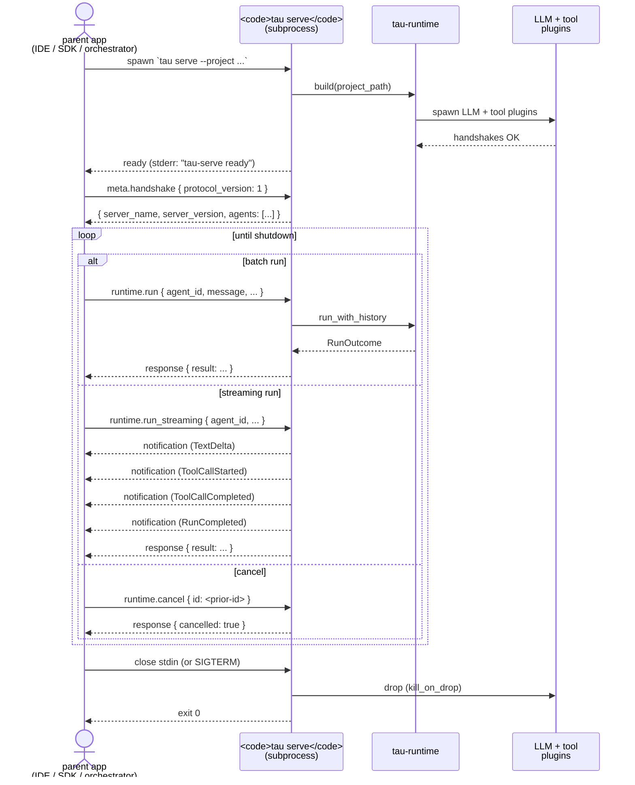
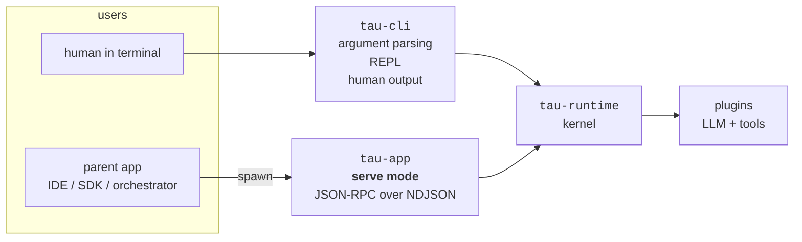

# Serve mode

Serve mode is tau running as a long-lived subprocess that speaks
**JSON-RPC 2.0 over NDJSON-framed stdio**. It's how parent
applications — IDE extensions, web servers, CI orchestrators,
language SDKs — embed tau without paying the plugin cold-start cost
for every invocation.

Serve mode is one of tau's **two formal public surfaces** (G6 +
QG12); the other is the `tau-runtime` Rust crate. Both are
versioned; both are stable within minor versions; both follow
SemVer (QG11). ADR-0033 records the v1 design.

For the precise wire format (every method, every parameter, every
error code), see the
[serve-mode protocol reference](../reference/serve-mode-protocol.md).
This page explains the model: why subprocess-over-stdio, what the
lifecycle looks like, and what serve mode deliberately is *not*.

## What problem this solves

The `tau` CLI is fine for interactive use, but every invocation
pays the same setup cost: parse the project manifest, resolve the
lockfile, spawn LLM-backend + tool plugins, wait for each plugin's
handshake. For a developer running `tau chat` once and talking for
an hour, that cost is negligible. For a parent application — say
an IDE extension issuing dozens of small `runtime.run` calls per
minute — paying it on every call would make tau unusable.

Serve mode amortises the cost. The parent spawns `tau serve` once,
sends N requests over stdin, receives N responses (or streams) over
stdout. The same runtime instance handles every call. Plugins stay
warm across requests. Cold-start happens once at server boot.

## The shape of a serve session

Three lifecycle phases:

1. **Boot.** Parent spawns the subprocess with `--project <path>`
   (defaults to cwd). Server parses `tau.toml`, resolves the
   lockfile, builds the runtime, spawns all declared plugins. If
   `--ready-on-stderr` is set, the server writes `tau-serve ready\n`
   to stderr once everything is up.
2. **Serve.** Parent sends one JSON-RPC request per line of stdin.
   Server processes each as an independent call against the shared
   runtime. Requests are concurrent up to `--max-concurrent`
   (default 8); excess returns `-32004 SERVER_BUSY` immediately.
3. **Shutdown.** Server initiates graceful shutdown on any of:
   stdin EOF, SIGTERM, SIGINT, parent death (`PR_SET_PDEATHSIG` on
   Linux), or `--idle-timeout` elapsed. In-flight requests get
   `--shutdown-grace` (default 5s) to drain before the runtime is
   dropped.

## Why JSON-RPC over NDJSON

ADR-0033 §"Alternatives considered" walks through what was rejected
and why:

- **JSON-RPC 2.0** — the simplest standard RPC spec that gives us
  request/response correlation by id, error codes, and a built-in
  notification primitive (for streaming events).
- **NDJSON framing** (newline-delimited JSON) — each JSON value
  occupies exactly one line of stdout. Trivial parser; debug with
  `cat`, `jq`, `tee`. LSP-style `Content-Length:` headers were
  considered and deferred behind an opt-in `--transport lsp` flag.
- **Stdio transport** — not HTTP. Tau is not a hosted service
  (NG3), does not manage authentication (NG9), and subprocess pipes
  are the lightest possible IPC. HTTP would add attack surface the
  design rejects.
- **MessagePack-RPC** — diverges from the Constitution wording
  ("JSON-RPC over stdio"); would force every external SDK to
  include a msgpack library; loses the operational property that
  anyone can debug the protocol with shell pipes.

The combined choice is intentionally boring — boring transports
are easy to inspect, easy to bridge, and never fail in surprising
ways.

## The v1 surface — five methods + one notification

| Method | Direction | Purpose |
|---|---|---|
| `meta.handshake` | client → server | first call; negotiates `protocol_version`. Required before any non-meta method. |
| `meta.ping` | client → server | liveness check; works pre-handshake. |
| `runtime.run` | client → server | batch agent run; returns a `RunOutcome`. |
| `runtime.run_streaming` | client → server | streaming agent run; emits `runtime.event` notifications correlated by request id, then a final response. |
| `runtime.cancel` | client → server | cancel an in-flight request by id (cooperative). |
| `runtime.event` | server → client | server-initiated notification carrying a `RunEvent` payload during a streaming run. |

The `RunEvent` shape — `TextDelta`, `ToolCallStarted`,
`ToolCallCompleted`, `TurnCompleted`, `RunCompleted`, `FatalError`
— is the same canonical event vocabulary defined by ADR-0011 for
the in-process streaming API. Serve mode reuses it verbatim. A
parent app that already speaks `tau-runtime`'s `RunEvent` stream
needs no translation layer to consume `runtime.event`
notifications.

## What lives inside vs. outside the protocol

v1's method surface is deliberately narrow. Five things stay
explicitly *outside* v1:

- **Session / persistence methods** (`session.*`). REPL sessions
  are available via the CLI (`tau session list/show/...`); serve-
  mode coverage waits for concrete demand.
- **Package management methods** (`pkg.*`). External orchestrators
  shell out to `tau install` / `tau resolve` as a one-time setup
  step before spawning `tau serve`.
- **Skill / workflow methods** (`skill.*`, `workflow.*`). Same
  reasoning — the CLI surface is the documented path; serve-mode
  parity lands when the embedding demand materialises.
- **LSP-style framing** (`--transport lsp`). Opt-in alternative
  transport reserved for IDE extensions that need it.
- **Sandbox enforcement.** v1 builds the runtime with
  `sandbox_plan = None` for plugin hosts. Production deployments
  that need sandboxed serve-mode plugin hosts should follow the
  ADR-0033 follow-up.

Future namespaces land as additive ADR amendments — never breaking
existing v1 clients.

## Error codes — tau's slice of the JSON-RPC space

JSON-RPC 2.0 reserves `-32099..-32000` for "server-defined" errors.
Tau claims this range:

- `-32000..-32010` — implemented in v1 (see [protocol
  reference](../reference/serve-mode-protocol.md#error-codes)).
- `-32011..-32099` — reserved for future ADR amendments.

The naming convention is `SCREAMING_SNAKE_CASE`. Each code has a
fixed semantic meaning across versions; future versions never
re-purpose a code.

## What serve mode is NOT

Five explicit non-purposes, anchored to constitutional non-goals:

- **Not a hosted service** (NG3). Serve mode is a *local
  subprocess* started by a parent process. The tau project ships a
  binary; it does not run infrastructure for users.
- **Not multi-tenant.** One runtime per process. No per-call
  project switching, no per-request authentication, no
  request-isolation beyond `max_concurrent` queueing. Multi-tenant
  deployments build that layer above tau.
- **Not a credential store** (NG9). Credentials are referenced by
  handle; the parent app provides the actual values via the
  runtime's existing credential mechanism. Serve mode doesn't ship
  any new credential API.
- **Not for high-volume cross-machine RPC.** Stdio is local-only
  by construction. For cross-machine RPC, wrap serve mode in a
  parent process that exposes the appropriate network transport
  (e.g., a Rust web server using `tau-app` directly).
- **Not the place to extend tau.** Adding functionality is still
  G7 territory — `tau install <package>`. Serve mode exposes the
  runtime's existing surface; it doesn't define new plugin-side
  primitives.

## Where serve mode fits in the architecture

Serve mode sits inside `crates/tau-app/`, which owns the "embed
tau in a parent process" surface. The CLI binary
(`crates/tau-cli/`) is a sibling — both build on the same
`tau-runtime` kernel:

A future SDK (npm, pip, etc.) wraps `tau-app`'s subprocess in a
language-idiomatic façade — `tau` Node module, `tau` Python class.
That's deliberately out of scope for the runtime project itself
(SDK is an addon package per the constitution architectural
implications).

## See also

- [Protocol reference](../reference/serve-mode-protocol.md) — every
  method, parameter, and error code.
- [Architecture overview](architecture-overview.md) — where serve
  mode sits in the request path.
- [Crate map](crate-map.md) — `tau-app` vs `tau-cli` vs
  `tau-runtime` boundaries.
- [`CONSTITUTION.md`](../../CONSTITUTION.md) G6, NG3, NG9, QG11,
  QG12 — guidelines this design satisfies.
- [ADR-0033](../decisions/0033-tau-serve-mode.md) — full design
  rationale, alternatives, deferred follow-ups.
- [ADR-0011](../decisions/0011-streaming-llm-responses.md) — the
  `RunEvent` shape `runtime.event` reuses.
