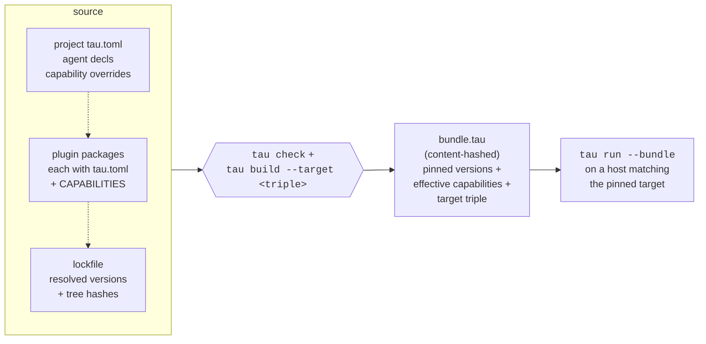

# Tau as a compiled language for agentic workflows

**Status:** Vision document — not a SemVer-binding contract. This
document describes the long-term design intent of the tau project.
Individual elements may be realized incrementally over many sub-
projects; some may be revised as the project matures.

**Date:** 2026-05-02 (initial draft alongside Tier 3 priority 12 —
sandboxing).

**Audience:** project contributors, ADR authors, and users who want
to understand where tau is heading beyond v0.1.

## The proposition

Tau is a **runtime + toolchain for agentic workflows that aspires to
the discipline of a compiled language.** A user writes a "tau
program" once — a project `tau.toml` declaring agents, their
package dependencies, capabilities, and (eventually) workflows —
and the toolchain compiles that program for a specific *target*.
If compilation succeeds, execution on that target is guaranteed
to be sandbox-correct, capability-correct, and dependency-resolved.

The reference is Rust:

> "If your code compiles, it runs. If it ran on `x86_64-linux-gnu`,
> it'll run on any `x86_64-linux-gnu`."

The tau analogue:

> "If `tau check --target <triple>` succeeds, `tau run --sandbox
> <triple>` will not fail with a sandbox-, capability-, or
> dependency-resolution error on any host whose available adapter
> matches the target."

The remaining failure surface is genuine runtime behavior — LLM
backend errors, tool dispatch errors, agent decisions — which is
deliberately recoverable through the `RunOutcome::Failed` and
`RunEvent::FatalError` paths already in the runtime. What gets
**eliminated** by compilation is the class of "this configuration
was never going to work" errors that surface mid-run today.

## What is a "tau program"?

The tau-language **source** for a project is the union of:

1. **Project `tau.toml`** — agent declarations, `[[requires.tools]]`
   dependencies, capability overrides, sandbox tier preferences.
2. **All required plugin packages** — including each plugin's own
   `tau.toml` manifest and embedded `CAPABILITIES` constant.
3. **Lockfile** — the resolved version of every dependency
   (`<scope>/lock.toml`), produced by `tau install` / `tau resolve`.

The tau-language **target** is a sandbox target triple that
specifies the execution environment's enforcement model and
capability surface. Examples:

- `linux-native-strict` — landlock + seccomp + namespaces; full
  per-host network filtering and per-command exec gating.
- `linux-native-light` — landlock only; binary network gating;
  binary exec gating.
- `container-podman` — Podman container with bind-mount filesystem
  capabilities and network namespace egress filtering.
- `remote-vercel` — managed cloud sandbox (e.g., Vercel Sandbox).
- `wasi-p2` — WebAssembly System Interface preview 2 (future).

The tau-language **artifact** of compilation is a "tau application
bundle" — a content-hashed deployment unit pinning:

- All resolved package versions + their tree hashes (priority 7
  primitive: ADR-0012's whole-tree SHA-256).
- The compiled capability-effective set per agent (priority 4
  primitive: `compute_effective`).
- The required capability shapes per plugin (this priority's
  contribution).
- The target sandbox triple.
- A bundle-level SHA pinning the whole compilation.

The tau-language **execution** is `tau run --bundle <bundle.tau>`
(or its streaming/REPL counterparts) on a host whose available
sandbox target matches the bundle's pinned target.

## What gets caught at "compile time"?

The validation hierarchy designed in priority 12's ADR-0014
already maps onto a compile-time / link-time / runtime split:

| Stage | What's caught |
|---|---|
| **Plugin author build (`cargo build`)** | Plugin SDK type-state + `#[capabilities(...)]` macro: capability declarations match plugin code surface. |
| **`tau install`** | Plugin manifest ↔ embedded `CAPABILITIES` constant disagreement (cross-check). |
| **`tau resolve` / `tau install`** | Dependency resolution (priority 5) — version conflicts, unreachable sources. |
| **`tau check` (future sub-project A)** | Static validation: every capability shape in every plugin must be supported by the target adapter. Project tau.toml's tier requests must respect deployment floors. Capability override (`compute_effective`) must produce a non-empty grant. |
| **`tau build --target <triple>` (future sub-project C)** | All the above + bundle production with content hash. |
| **`tau run` startup** | Adapter probe + final cross-check (Layer 3 of priority 12's design). On a match against a previously-built bundle, this is a fast verification rather than a re-derivation. |
| **Plugin runtime** | OS sandbox enforcement (Layer 4 of priority 12's design). Catches plugin-vs-declaration drift. |

The first six stages eliminate ENTIRE CLASSES of failures from
runtime. The seventh exists for defense-in-depth: even if every
prior layer was correct, a buggy or compromised plugin can still
attempt a violation at runtime; the OS sandbox is the final
backstop.

## Why this matters

### Common ground truth

A team writing a tau program can hand it off — to a colleague's
laptop, to CI, to a production server — with a single, verifiable
guarantee: **if this bundle was built for this target, it will run
on this target.** No "works on my machine" surprises. No silent
sandbox degradation. No "but on CI it crashes because seccomp
blocked something."

This is the same guarantee Rust gives developers and the same
guarantee Docker gives operators, applied to the agent-workflow
domain.

### Defensive composition

Agent workflows compose human prompts, LLM completions, and tool
calls. The composition is inherently uncertain (an LLM might
request anything). What CAN be made certain is the *boundary*: the
set of operations a tool is permitted to perform on the user's
machine. By making that boundary a compile-time property, we
push the uncertainty surface where it belongs (the LLM's output)
and out of where it doesn't (the system's enforcement).

### Distribution

A tau application bundle is a single artifact you can sign,
publish, audit, and verify. The "tau equivalent of a Rust binary
or Docker image" is a real workflow: compile your agent workflow
once, distribute the bundle, run it anywhere a matching target
exists.

## Realization roadmap

Each item below is a future sub-project with its own ADR. Order is
tentative; some can run in parallel.

### Sub-project A — `tau check` subcommand

Static validation as a standalone CLI verb. Reuses priority 12's
Layer 3 logic but invocable independently of `tau run`. Target use
cases: CI gates ("does this branch's tau.toml validate?"), IDE
extensions, pre-commit hooks. Estimated scope: ~3 weeks.

### Sub-project B — Tau target triple registry

Shipped 2026-05-19 — see [ADR-0034](../decisions/0034-target-triple-registry.md)
and [the target-triple reference](../reference/target-triples.md). Three-axis
structural identifier (`Platform` × `AdapterFamily` × `SandboxTier`); v1 ships
5 Available + 1 Reserved triple; CLI surface: `tau target list`/`show` and
`tau check --target`.

### Sub-project C — `tau build --target <triple>` subcommand

Produces the deployment artifact. Bundle format design + content
hashing + reproducibility verification. Builds on priority 7's
`tree_hash` and `verify` primitives. `tau run --bundle <file>`
executes a bundle. Estimated scope: ~6 weeks.

### Sub-project D — Capability vocabulary forward-compatibility

Versioning + stability guarantees for `CapabilityShape`. A bundle
compiled against tau v1.2's capability shapes must continue to run
on tau v1.3+ with new shapes added. Stability discipline + ADR
amendments. Estimated scope: ~2 weeks (heavy on ADR, light on
code).

### Sub-project E — Cross-machine reproducibility verification

Extends `tau verify` (priority 7) so a deployed bundle on a target
machine can be verified to match the bundle the project author
built. Detects bundle tampering between build and run.
Estimated scope: ~3 weeks.

### Sub-project F — Remote target backends

Vercel Sandbox, Sandcastle, generic remote-execution providers.
Each is an additional `Sandbox` impl. Major design concerns:
authentication, IPC channel networking, cold-start latency budgets.
Estimated scope per backend: ~4-6 weeks.

### Sub-project G — WASM target backend

Most ambitious. Plugins compile to `wasm32-wasip2`. The
`tau-plugin-sdk` migrates to support the new ABI. Plugin
distribution becomes `.wasm` artifacts. Plausibly a Phase 2 effort
in its own right. Estimated scope: ~12+ weeks.

## What this is NOT

- **Not a programming language** in the classical sense. There is
  no tau-source-file parsed by a tau-frontend that generates code.
  The "language" is the configuration grammar of `tau.toml` plus
  the runtime semantics of the agent loop. "Compilation" is
  validation + lockfile + bundle production, not code generation.
- **Not a replacement for Rust.** Plugins are still written in
  Rust (today; potentially WASI-targeted Rust via WASM target
  later). Tau is the build system + runtime + sandbox layer
  ABOVE plugins, not the language they're written in.
- **Not a marketplace or registry.** Distribution mechanisms are
  separate concerns. A tau bundle could be distributed via git,
  http, OCI registry, or any other mechanism; tau the toolchain is
  agnostic.
- **Not a v1.0 commitment.** This document is a vision; individual
  elements may shift as sub-projects deliver. The current
  Phase-1-and-Tier-3 work establishes the foundations; Phase 2 (as
  outlined above) realizes the vision.

## Status (as of 2026-05-02)

| Component | Status |
|---|---|
| Project tau.toml schema | ✅ Phase 0 + capability override (priority 4) |
| Plugin manifest + capabilities | ✅ Phase 0 + ADR-0010 schema validation (priority 6) |
| Dependency resolution | ✅ Tier 2 priority 5 |
| Lockfile (resolved versions + tree hashes) | ✅ Tier 2 priorities 6 + 7 |
| Plugin install / verify / update / uninstall | ✅ Tier 2 priority 7 |
| Streaming runtime (foundation for bundles to execute) | ✅ Tier 2 priority 8 |
| REPL persistence (sessions are lightweight artifacts) | ✅ Tier 3 priority 11 |
| Sandbox port + adapter pattern | 🚧 Tier 3 priority 12 (in progress) |
| Capability shape vocabulary (typed enum) | 🚧 Tier 3 priority 12 |
| Multi-agent orchestration | 📅 Tier 3 priority 9 (deferred) |
| Workflow / pipeline runner | 📅 Tier 3 priority 10 (deferred) |
| `tau check` | 📅 Phase 2 sub-project A |
| Target triple registry | ✅ shipped 2026-05-19 |
| `tau build --target` + bundle format | 📅 Phase 2 sub-project C |
| Capability forward-compatibility | 📅 Phase 2 sub-project D |
| Cross-machine bundle verification | 📅 Phase 2 sub-project E |
| Remote target backends | 📅 Phase 2 sub-project F |
| WASM target backend | 📅 Phase 2 sub-project G |

## References

- ADR-0006 — runtime architecture, capability model.
- ADR-0007 — CLI surface, exit code policy.
- ADR-0011 — streaming LLM responses.
- ADR-0012 — lifecycle commands, source-agnostic verify.
- ADR-0013 — REPL persistence, hexagonal session storage.
- ADR-0014 — sandboxing port + adapter pattern (this priority's
  output; the foundation for everything Phase 2 builds on).
- `crates/tau-pkg/src/install.rs` — install pipeline.
- `crates/tau-pkg/src/resolve.rs` — dependency resolution.
- `crates/tau-pkg/src/tree_hash.rs` — content-hashing primitive
  (verify foundation).
- `crates/tau-pkg/src/verify.rs` — verify primitive (bundle
  verification foundation).
- `crates/tau-runtime/src/stream.rs` — streaming pump (bundle
  execution foundation).
