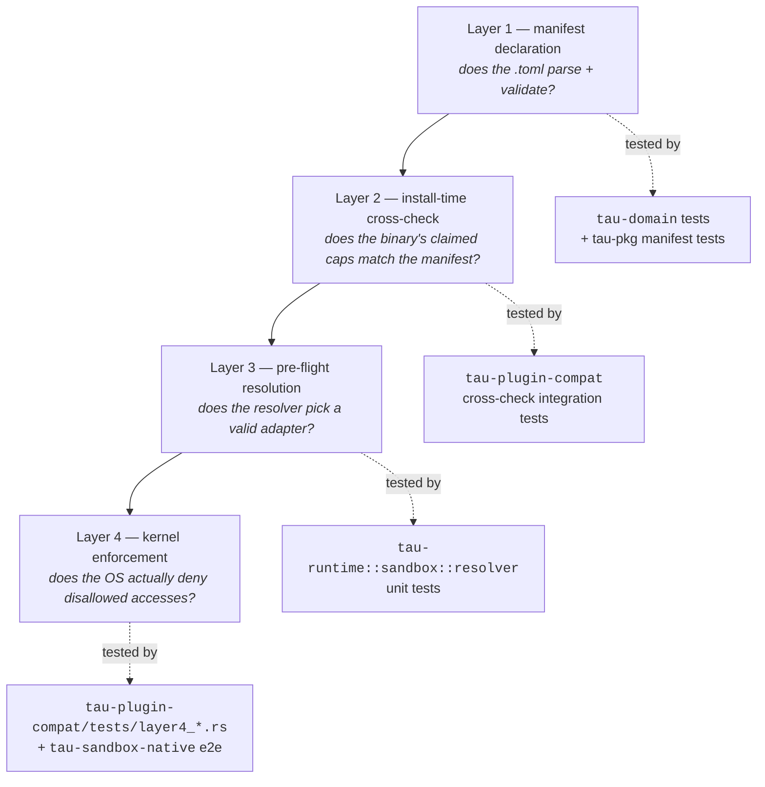

# Testing strategy

Tau has a four-layer testing pyramid, on top of the standard Rust
unit / integration / doc-test layers. Each layer answers a
different question, and each new contribution lands at the right
layer for what it claims. This page is the contributor-facing
summary.

For *what* gets enforced at each layer (the sandbox model), read
[Sandboxing](sandboxing.md). For *where* tests live by crate, see
the [Crate map](crate-map.md).

## The standard Rust layers (QG5)

Every crate provides:

| Layer | Where | What it catches |
|---|---|---|
| Unit tests | `#[cfg(test)] mod tests` inside the source | Logic in isolation; pure functions; small builders. |
| Integration tests | `tests/*.rs` per crate | Public-API contracts; behavior across module boundaries. |
| Doc tests | `///` rustdoc examples in public items | Public API examples actually compile and run. Required for `tau-runtime`, `tau-pkg`, `tau-domain`, `tau-ports`, `tau-sdk` (QG9: `#![deny(missing_docs)]`). |
| CLI behavioral | `tests/cmd_*.rs` in `tau-cli` (via `assert_cmd`) | The `tau` binary's user-facing flags, output, exit codes. |
| Property-based | `proptest` + `tests/prop_*.rs` | Manifest parsers, IPC message round-trips, user-input shapes. |
| Fuzz targets | `fuzz/fuzz_targets/*.rs` | IPC protocol robustness. |

CI runs every layer on every PR. The unit + integration + CLI
layers complete inside the 3-minute inner-loop budget (G17).

## The four sandbox-test layers (ADR-0014 + ADR-0016 + ADR-0017)

Sandboxing adds its own four-layer model that overlaps with the
standard pyramid above but answers different questions:

| Layer | Question | Where tests live | Notes |
|---|---|---|---|
| **L1 — Manifest** | Does the `.toml` parse + validate? | `crates/tau-domain/src/package/{manifest,capability,sandbox}.rs::tests` and `crates/tau-pkg/tests/manifest.rs` | Cheap. Add a test for every new field, every validation rule. |
| **L2 — Install-time cross-check** | Does the plugin binary's claimed capability set match the manifest? | `crates/tau-plugin-compat/tests/cross_check_*.rs` | Spawns the plugin binary, runs `meta.handshake` + `tool.describe_capabilities`, compares against the manifest bidirectionally. |
| **L3 — Pre-flight resolution** | Does the resolver pick an adapter that can satisfy the plan? | `crates/tau-runtime/src/sandbox/resolver.rs::tests` | Mock adapters with explicit advertisements. Fast unit-level. |
| **L4 — Kernel enforcement** | Does the OS actually deny disallowed accesses? | `crates/tau-plugin-compat/tests/layer4_*.rs` (Container + Native variants) and `crates/tau-sandbox-native/tests/strict_*.rs` | Real kernel, real plugin spawn, real syscall. Slow. CI gates this on Linux. |

The four-layer model is the design contract; this page reflects
where the actual tests live in the workspace.

## Where to put a test for a new feature

Think about what your feature could break at each layer:

- **Adding a new `Capability` variant** → L1 (manifest parses)
  + new shape unit test in `tau-domain::package::capability::tests`
  + resolver test (L3) showing an adapter advertising it
  + adapter-side L4 test if a real kernel rule is wired.
- **Adding a new tool method** → L2 (cross-check sees the new
  method's required capabilities) + plugin-side unit test + an
  integration test under that plugin's `tests/`.
- **Adding a new sandbox adapter** → at minimum L3 (registry
  registration + probe behavior) + L4 (real kernel test under
  the adapter's own crate).
- **Adding a CLI flag** → CLI behavioral test in `tau-cli/tests/`
  + a unit test in `tau-cli::cli` if the parse is non-trivial.
- **Adding an orchestration primitive** → unit tests in
  `tau-runtime::orchestration` + integration test using
  `MockLlmBackend` (the v1.1 Skills-4 fixture) for any pattern
  that depends on LLM responses.

## Test fixtures and helpers worth knowing

| Helper | Crate | Purpose |
|---|---|---|
| `InProcessHost<T>` | `tau-plugin-test-support` | Drive a `Tool` impl without spawning a subprocess. Tests run in-process; handshake + dispatch are mocked. |
| `granted(caps)` | `tau-plugin-test-support` | Build a fake `SessionContext` with arbitrary granted capabilities. |
| `MockLlmBackend` | `tau-runtime::testing` | Replay scripted LLM completions. Required for multi-agent pattern tests (Skills-4 contribution). |
| `setup_echo_project` | `tau-cli/tests/common/mod.rs` | Build a temp dir with a synthesized `tau.toml` + lockfile + `echo-llm` binary path. Used by `cmd_chat*.rs` tests. |
| `ensure_echo_plugins_built` | `tau-cli/tests/common/echo_plugins.rs` | Session-cached `cargo build --release -p echo-llm -p echo-tool`. Amortizes the build cost across the test binary. |
| `tau-plugin-test-support` | `tau-plugin-test-support` | Cross-platform `pick_binary` helper for `.exe` vs no-extension. |

## Layer 4 / CI quirks

The Linux Layer 4 tests are the slowest in CI. Three things to know:

- **`/bin → /usr/bin` symlink** — Ubuntu's `/bin` is a symlink, and
  landlock V1 returns EACCES on real-binary spawns unless paths are
  resolved through `resolve_symlinks_for_landlock` first (ADR-0017
  + sub-project B). `crates/landlock-exec-repro/` stays in-tree as
  the reproducer for any regression.
- **Privileged Docker is no longer needed.** ADR-0019 (per-host
  veth + nftables) was superseded by ADR-0020 (userspace HTTPS
  proxy). CI runs on stock `ubuntu-latest`.
- **macOS Layer 4** runs on the GitHub-hosted macos-latest runner.
  The `sandbox-exec` profile lives at `/tmp/tau-darwin-<pid>-<n>.sb`
  during a test.

## Doctest discipline

Doctests run via `cargo test --doc` (nextest support is incomplete
for doctests). Every public `tau-domain` / `tau-ports` /
`tau-runtime` / `tau-pkg` item has at least one example per QG9.
Doctests are *examples*, not behavior tests; behavior tests
duplicate the example in `tests/` so doctest failures don't shoot
the test suite.

## What the test suite does not cover

Three honest limits:

- **No load testing.** Performance budgets (G16) are enforced by
  microbenchmarks under `target/criterion/`, not by load tests.
- **No long-running stability tests.** Day-long REPL sessions are
  not exercised; ADR-0013's REPL persistence model claims
  bug-for-bug fidelity across restarts but isn't soaked.
- **No security fuzzing of the sandbox primitives themselves.**
  We trust the kernel primitives (landlock, seccomp, SBPL,
  AppContainer); test that our *call* into them is correct, not
  that they themselves are correct.

These are tracked as Phase 2 hardening items.

## See also

- [Architecture overview](architecture-overview.md) — what each
  layer protects.
- [Sandboxing](sandboxing.md) — the four-layer enforcement model
  in user-facing terms.
- [Crate map](crate-map.md) — where each test lives by crate.
- [ADR-0017](../decisions/0017-e2e-landlock-and-driver.md) — the
  Layer 4 e2e driver.
- [ADR-0018](../decisions/0018-ci-optimization.md) — the CI
  optimization rounds that produced the current shape.
- `docs/test-ignores-inventory.md` — currently `#[ignore]`'d tests
  with triage status.
- [`CONSTITUTION.md`](../../CONSTITUTION.md) §3 (QG5, QG9, QG17) —
  the rules these tests implement.
