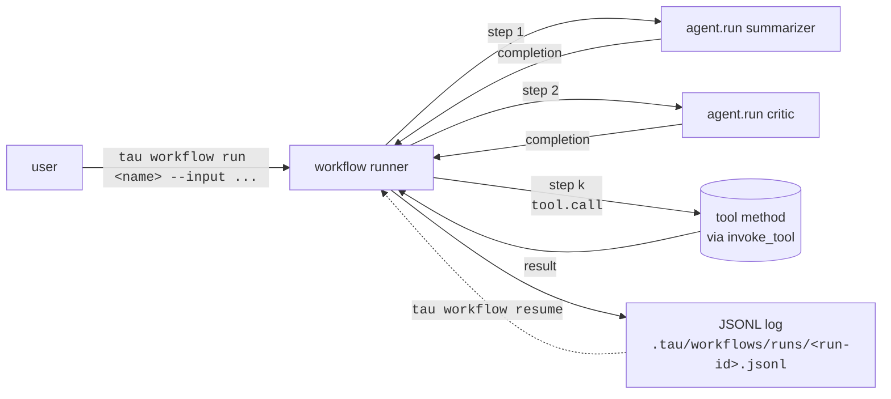

# Workflows

A workflow is a deterministic, step-by-step pipeline of agent runs
and tool calls, persisted to disk, resumable, and authored as a
single TOML file. Workflows are the *external-script-driven*
counterpart to [in-run multi-agent
orchestration](multi-agent-orchestration.md): orchestration composes
agents from inside one root agent's tool loop; a workflow composes
agents (and direct tool calls) from outside, with no LLM in the
glue between steps.

This page explains the model, when to reach for it vs in-run
orchestration, and what v1 deliberately doesn't ship.

## What problem this solves

Inside an agent's tool loop, the LLM decides what comes next.
That's exactly what you want for open-ended work, and exactly what
you don't want for "always run X, then Y, then Z" pipelines —
where every LLM round-trip adds latency, cost, and a slim chance
of the model deciding to skip step Y. Workflows give you the same
sandboxed plugin host (`tau run`'s machinery), the same capability
checks, the same JSONL persistence — but the *transitions* between
steps are written in TOML, not delegated to a model.

## The shape of a workflow

A workflow lives under `workflows/<name>.toml` at the project root.
Minimal example:

```toml
[workflow]
name        = "summarize-and-critique"
description = "Summarize a doc, then critique the summary."

[[steps]]
id    = "summarize"
kind  = "agent.run"
agent = "summarizer"
input = "${input}"

[[steps]]
id    = "critique"
kind  = "agent.run"
agent = "critic"
input = "${steps.summarize.output}"
```

Two `kind` values v1 supports:

- **`agent.run`** — spawn one of the project's declared agents
  (from `tau.toml`'s `[agents.<id>]`), feed it the rendered
  `input`, capture its final completion as the step's output.
- **`tool.call`** — invoke a single tool method directly without
  an LLM round-trip. Uses `Runtime::invoke_tool` under the hood —
  same capability checks, same sandbox, no model latency.

Templates use `${input}` (the workflow's top-level input) and
`${steps.<id>.output}` (any prior step's captured output) as flat
string substitutions. No conditionals, no loops, no expression
language. ADR-0022 §"Decision" pins this scope.

## How a workflow runs



Verbs the user sees:

| Command | Purpose |
|---|---|
| `tau workflow list` | enumerate `workflows/*.toml` |
| `tau workflow run <name> --input <text>` | execute end-to-end |
| `tau workflow log <run-id>` | read a previous run's JSONL trace |
| `tau workflow resume <run-id>` | continue an interrupted run from the last completed step |

The runner is a `tau-workflow` crate; the CLI is a thin dispatcher.
Both consume the same `tau-runtime` kernel as `tau run` / `tau
chat`, which means workflows inherit the full sandbox + capability
stack for free.

## Workflows vs in-run orchestration

When to reach for which:

| Trait | Workflow | [In-run orchestration](multi-agent-orchestration.md) |
|---|---|---|
| Who decides the next step | TOML author | the parent agent's LLM |
| LLM hops between steps | zero (glue is deterministic) | one per `agent.<kind>.spawn` |
| Persistence | one JSONL per run | trace inside the run |
| Resumability | `tau workflow resume` | within a session via REPL persistence |
| Topology | linear list of steps | tree (five named patterns) |
| Tool calls without an agent | yes — `tool.call` step | yes — but inside an agent's loop |
| Typical lifetime | minutes to hours | seconds to minutes |
| Right-tool-for-the-job | "always run A then B then C" | "the agent decides what to do next" |

Both compose: a single workflow step can be an `agent.run` that
itself spawns sub-agents via orchestration. The wire to
`Runtime::run_with_history` is the same.

## The persistence promise

Every step's input, output, started/ended timestamps, and capture
of any error are appended to
`<scope>/.tau/workflows/runs/<run-id>.jsonl`. The format is
committed to as a public surface — schema changes will be additive
with a once-per-process warn on read, same model as the lockfile
v3→v4 transition (ADR-0026).

Consequences:

- **Inspectable post-mortem.** `tau workflow log <run-id>` is a
  plain file dump; no special tooling. The trace is grep-able by
  agent id, step id, or status.
- **Resumable on demand.** `tau workflow resume <run-id>` reads
  the JSONL, replays its declared state, picks up at the first
  step without a completion record.
- **Deterministic, not idempotent.** A resumed run will not
  re-execute steps that already completed. If a step had a
  side-effect that the user wants re-attempted, deleting that
  step's JSONL record is the supported escape hatch.

## v1 deliberate limits

Per ADR-0022 §"v1 limitations":

- **Single Runtime per workflow.** The runtime is built from the
  first referenced agent's plugin config. Workflows whose agents
  use different LLM-backend packages will work but share one
  backend instance.
- **No DAG.** Steps execute in declaration order. Parallel fan-out
  / fan-in / conditional branches are deferred (sub-project
  "workflow-DAG").
- **No conditionals or expressions.** Templates are flat string
  substitution. No `if`, no loops, no variable assignment beyond
  `${steps.<id>.output}`.
- **No per-step capability override.** A step inherits the
  capabilities of the referenced agent verbatim.
- **No scheduling.** Cron-style "run this nightly" is not in
  scope; that's an `at` / `cron` / `launchd` problem and tau is
  not a workflow engine (NG5).

## What this is not

Two clarifications, drawn from the constitution non-goals:

- **Not a general-purpose workflow engine** (NG5). "Pipeline" in
  tau means "coordinates agents," not "coordinates arbitrary
  tasks." `tool.call` exists to avoid forcing an LLM round-trip on
  the trivial cases; it does not turn tau into a substitute for
  Airflow / Temporal / n8n.
- **Not an alternative to in-run orchestration** (G9). The same
  composition primitives sit under both surfaces. Pick the one
  whose authoring model fits the problem; mix freely.

## See also

- [Multi-agent orchestration](multi-agent-orchestration.md) — the
  in-run companion. Use that when the LLM decides what's next.
- [Packages](packages.md) — workflows reference agents; agents
  reference packages.
- [Capabilities and consent](capabilities-and-consent.md) — each
  step inherits its referenced agent's grant.
- [Sandboxing](sandboxing.md) — every step's plugin spawn flows
  through the same adapter resolution.
- [ADR-0022](../decisions/0022-tau-workflow.md) — full design
  rationale + v1 limits + considered alternatives.
- `Runtime::invoke_tool` (in `tau-runtime`) — the API `tool.call`
  steps go through.
