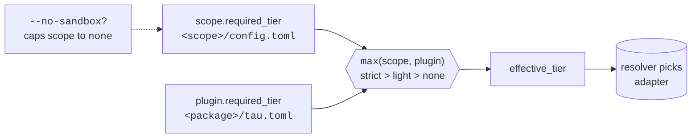

# Configure the sandbox tier

You want to control how strictly tau isolates plugin processes — for
a project, for an individual plugin, or for a one-off invocation.
This recipe covers the three knobs and what each one does.

If you don't yet know the model, read [Sandboxing](../explanation/sandboxing.md)
first. The full schema is in the [package manifest
reference](../reference/package-manifest-schema.md#sandbox-block).

## The three knobs

| Where | Field | What it controls |
|---|---|---|
| `<scope>/config.toml` (project or global) | `[sandbox] required_tier` | The floor for every plugin spawned under this scope. |
| `<package>/tau.toml` | `[sandbox] required_tier` | The floor a specific plugin demands; the resolver intersects with the scope. |
| Command line | `--no-sandbox` | One-shot override; routes to the `passthrough` adapter. |

The resolver picks the **strongest** tier consistent with all three.
"Stronger" means `strict > light > none`.



Two consequences of the `max(...)` rule worth being explicit about:

- **`--no-sandbox` only relaxes the scope**, not the plugin. A plugin
  with `required_tier = "strict"` refuses to load even with
  `--no-sandbox`.
- **A plugin's `required_tier` is a floor, not a cap.** A plugin
  declaring `required_tier = "light"` running in a `strict` scope
  still gets `strict`.

## Per-project: change the scope's required tier

A scope is either project-local (`.tau/` walked up from cwd) or
global (`~/.tau`). Each has its own `config.toml`:

```toml
# .tau/config.toml or ~/.tau/config.toml
schema_version = 3
kind = "project"        # or "global"
created_at = "2026-05-17T00:00:00Z"
created_by_tau_version = "0.6.0"

[sandbox]
required_tier   = "strict"
required_shapes = []
```

Three valid values for `required_tier`:

- `"strict"` — full defence-in-depth. Default if the file is absent.
- `"light"` — filesystem narrowing only.
- `"none"` — no isolation; routes to passthrough.

To rewrite the block to a new tier without hand-editing:

```bash
tau sandbox setup --tier strict       # or light / none
```

`tau sandbox setup` re-emits the v3 schema and migrates older v2
configs (`chain` + `minimum_tier`) as a side-effect.

### Choosing a tier for a project

| Tier | Use when |
|---|---|
| `strict` | Default. Anything that handles untrusted input, talks to a network, or runs subprocesses. All five real plugins (`anthropic`, `openai`, `ollama`, `fs-read`, `shell`) need this. |
| `light` | A project that only runs read-only tool plugins on a local tree and you want CI startup speed without the proxy. |
| `none` | Local development against in-tree binaries the resolver can't satisfy strict for — e.g. test fixtures, plugins behind a `[plugin.kind = "rust-cargo"]` you're iterating on. Never for production. |

## Per-package: a plugin demands a stronger floor

A plugin author can refuse to load against a weaker scope by setting
the manifest's `[sandbox] required_tier`:

```toml
# crates/your-plugin/tau.toml
[sandbox]
required_tier = "strict"
```

This is symmetric to the scope-level setting. The resolver computes
`max(scope.required_tier, plugin.required_tier)` and picks the
adapter that satisfies it; if no registered adapter on this host
can deliver the tier, install / spawn fails with a guided
diagnostic.

The plugin's `required_tier` is *not* the operative grant — the
scope's tier may be stronger. The plugin's value is a **floor**:
"I will not load with less than this".

## Per-invocation: opt out for one command

```bash
tau run agent-id "prompt"  --no-sandbox
tau chat agent-id           --no-sandbox
```

`--no-sandbox` routes that invocation through the `passthrough`
adapter. It is honoured **only** when the scope and plugin floors
both permit `none`. A plugin that declares `required_tier = "strict"`
will refuse to load even with `--no-sandbox` — the flag relaxes the
scope, not the plugin.

For unconditional bypass (e.g. local plugin development), set the
scope to `required_tier = "none"` *and* clear the plugin manifest's
`required_tier` (or `"none"`).

## Per-capability shape: pin required shapes

`required_shapes` lets a scope or plugin assert that specific kernel
primitives must be available, beyond what `required_tier` implies:

```toml
[sandbox]
required_tier   = "light"
required_shapes = ["FilesystemRead", "NetworkHttp"]
```

The resolver rejects adapters that can't advertise every listed
shape. Most users do not need to set this — it auto-derives from
the union of declared capabilities. Set it explicitly when:

- You want install to fail on a host that lacks the proxy
  infrastructure even if the scope tier doesn't strictly require
  network isolation.
- You're authoring tests that need to assert "this plan really did
  go through the strict-tier network containment path."

Shape values are PascalCase strings; the
[manifest reference](../reference/package-manifest-schema.md#sandbox-block)
lists every one.

## Quick recipes

### "Always strict for this project, fail loudly if we can't deliver"

```toml
# .tau/config.toml
[sandbox]
required_tier = "strict"
```

On a host where the registered adapters can't deliver strict (e.g.
macOS without `sandbox-exec` available, Linux kernel < 5.13), every
`tau install` and `tau run` fails with the resolver's diagnostic.

### "Use light tier for read-only tooling"

```toml
# .tau/config.toml
[sandbox]
required_tier = "light"
```

Plugins that declare `required_tier = "strict"` still refuse to load
— their floor is independent of the scope's.

### "Local development: build a plugin, run it, no sandbox"

```toml
# .tau/config.toml
[sandbox]
required_tier = "none"
```

```toml
# crates/my-plugin/tau.toml — omit the [sandbox] block entirely
```

Run with `tau run` (no flag needed — the scope is already
`"none"`). Switch the scope back to `"strict"` before merging.

### "Override a chatty tool's network grant without changing the package"

Capability narrowing isn't a `[sandbox]` concern — see the
project-side override pattern under
`[agents.<id>.capability_overrides]` in `crates/tau-cli/src/config/project.rs`.
The sandbox tier controls *enforcement*; the override controls
*grant*. They compose.

## Verification

After changing any of the three knobs:

```bash
tau resolve --check-sandbox
```

Walks the lockfile, resolves an adapter for every installed plugin
against the current scope, and reports which would succeed and
which would fail. Use it in CI as a gate (ADR-0015 Decision 1
recommends this).

For diagnosing a specific failure:

```bash
tau sandbox probe
```

Lists every registered adapter on this host and the tiers + shapes
it advertises. If the adapter you expect to win isn't `Available`,
this is where you'll see why ("kernel < 5.13", "docker not on
PATH", etc.).

## See also

- [Sandboxing](../explanation/sandboxing.md) — tier model and
  resolver.
- [Capabilities and consent](../explanation/capabilities-and-consent.md)
  — how the granted capability set composes with the tier.
- [Package manifest schema](../reference/package-manifest-schema.md)
  — `[sandbox]` block fields.
- [Sandbox platform support](../reference/sandbox-platform-support.md)
  — which adapter delivers which tier on which OS.
- [ADR-0015](../decisions/0015-sandbox-activation.md) — declarative
  requirements + resolver design.
