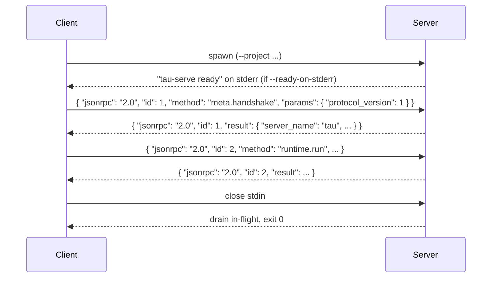

# Serve mode protocol

Wire-level reference for the JSON-RPC 2.0 + NDJSON protocol tau
serve mode speaks. For the model and rationale, read
[Serve mode](../explanation/serve-mode.md). The protocol is
formally pinned by [ADR-0033](../decisions/0033-tau-serve-mode.md);
this page reflects v1 of the protocol.

The protocol is one of tau's **two public surfaces** (G6). It
follows SemVer (QG11): additive method namespaces land via ADR
amendment without bumping the major; breaking changes don't ship
within a minor version.

The authoritative source is `crates/tau-app/src/serve/`. Every
constant on this page is sourced from
`crates/tau-app/src/serve/{protocol,error_codes,methods}.rs`.

## Transport

| Property | Value |
|---|---|
| Wire | NDJSON over the subprocess's stdin / stdout |
| Framing | One JSON value per line, terminated by `\n` |
| Encoding | UTF-8 |
| Direction | Bidirectional — server emits notifications interleaved with responses |
| Side channel | stderr is for human-readable diagnostics only; never carries protocol payload |

The server reads exactly one JSON value per line of stdin and
writes exactly one JSON value per line of stdout. Multi-line JSON
is not supported; pretty-printed input is rejected at the parser.

## Server lifecycle



The client speaks first. The handshake establishes
`protocol_version` (must be `1` in v1). Subsequent calls without a
prior handshake return `-32002 HANDSHAKE_REQUIRED`. A second
handshake returns `-32003 ALREADY_HANDSHAKEN`. Pre-handshake
`meta.ping` is allowed (so a client can liveness-check before
committing to a protocol version).

## Server start-up flags

| Flag | Default | Meaning |
|---|---|---|
| `--project <path>` | cwd | absolute path to the tau project directory |
| `--max-concurrent <N>` | 8 | max in-flight requests; excess returns `-32004` |
| `--idle-timeout <duration>` | none | graceful shutdown after no activity for this duration |
| `--ready-on-stderr` | off | write `"tau-serve ready\n"` to stderr after boot completes |
| `--shutdown-grace <duration>` | 5s | how long to wait for in-flight requests to drain on shutdown |

These match the `ServeOptions` struct in
`crates/tau-app/src/serve/options.rs`.

## Message envelopes

All messages are JSON-RPC 2.0 — i.e. carry `"jsonrpc": "2.0"`.

### Request (client → server)

```json
{
  "jsonrpc": "2.0",
  "id":      <RequestId>,
  "method":  "<method-name>",
  "params":  <object>
}
```

`id` may be a string or number (server preserves the exact value
in the response). `params` is required for every v1 method,
including `meta.handshake` and `meta.ping` (which accept `{}`).

### Response (server → client, success)

```json
{
  "jsonrpc": "2.0",
  "id":      <matches request>,
  "result":  <object>
}
```

### Response (server → client, error)

```json
{
  "jsonrpc": "2.0",
  "id":      <matches request, or null on parse error>,
  "error": {
    "code":    <integer>,
    "message": "<string>",
    "data":    <object | null>
  }
}
```

### Notification (server → client)

```json
{
  "jsonrpc": "2.0",
  "method":  "runtime.event",
  "params":  <object>
}
```

Notifications have **no `id`** (JSON-RPC 2.0 §6). The server only
emits the one notification method `runtime.event` in v1.

## Method surface

### `meta.handshake`

Required first call (with one exception, `meta.ping`, which is
allowed pre-handshake).

**Params:**

```json
{ "protocol_version": 1 }
```

**Result:**

```json
{
  "server_name":     "tau",
  "server_version":  "<semver, e.g. 0.6.0>",
  "protocol_version": 1,
  "project_path":    "<absolute path>",
  "agents":          ["<agent-id>", ...]
}
```

Errors:

- `-32000 HANDSHAKE_MISMATCH` — `protocol_version != 1`. Error
  data: `{"supported_versions": [1]}`.
- `-32003 ALREADY_HANDSHAKEN` — second `meta.handshake` call.

### `meta.ping`

Liveness check. Allowed pre-handshake (no protocol-version
dependency).

**Params:** `{}` (no fields required).

**Result:** `{ "ok": true }`.

### `runtime.run`

Batch agent run. Returns a single `RunOutcome` after the agent
completes.

**Params:**

```json
{
  "agent_id":         "<string, must match an entry from handshake's `agents`>",
  "message":          { ... },
  "history":          [ ... ],
  "session_id":       "<optional>",
  "max_tokens":       <optional int>,
  "max_turns":        <optional int>
}
```

`message` and `history` use `tau-domain::Message`'s canonical
shape.

**Result:** a `RunOutcome` — either `{ "kind": "Completed", ... }`
or `{ "kind": "Failed", "reason": "<typed>" }`. The `RunOutcome`
shape is defined in `tau-runtime::RunOutcome`.

Errors:

- `-32010 UNKNOWN_AGENT` — `agent_id` not in the project.
- `-32007 CAPABILITY_DENIED` — agent attempted a tool call its
  grant doesn't cover.
- `-32008 TOOL_ERROR` — tool plugin returned an error.
- `-32009 LLM_ERROR` — LLM backend returned an error.
- `-32006 RUNTIME_ERROR` — operational error inside the runtime.

### `runtime.run_streaming`

Streaming agent run. Emits zero or more `runtime.event`
notifications correlated by the request id, then a final response
(success or error).

**Params:** same as `runtime.run`.

**Result:** same `RunOutcome` as `runtime.run`, sent only after
the stream completes.

**Notifications:** `runtime.event` (see below).

### `runtime.cancel`

Cooperative cancel. The server signals the target request's task
to wind down; the request completes with a `-32001 CANCELLED`
error and partial state in `error.data` where available.

**Params:**

```json
{ "id": <RequestId of an in-flight call> }
```

**Result:** `{ "cancelled": true }`. The cancelled request itself
emits `-32001 CANCELLED` separately.

### `runtime.event` (server → client notification)

Emitted during a `runtime.run_streaming` call.

**Params:**

```json
{
  "id":   <RequestId of the streaming call this event belongs to>,
  "kind": "<RunEvent variant>",
  "data": { ... }
}
```

`kind` is one of (from ADR-0011's `RunEvent`):

| `kind` | When |
|---|---|
| `TextDelta` | New tokens from the LLM. `data` includes the delta string. |
| `ToolCallStarted` | The agent invoked a tool. |
| `ToolCallCompleted` | Tool returned. |
| `TurnCompleted` | One LLM round-trip finished. |
| `RunCompleted` | All turns done; the final response is next. |
| `FatalError` | An error terminating the run. |

The notification stream ends with a regular response carrying the
`RunOutcome`. A client that loses the response (e.g. crashes
mid-stream) sees an orphaned event stream from the server's point
of view; the server eventually shuts down on stdin EOF.

## Error codes

Tau claims `-32000..-32099` of the JSON-RPC 2.0 server-defined
error range. v1 implements `-32000..-32010`; `-32011..-32099` are
reserved for future ADR amendments.

| Code | Constant | Meaning |
|---|---|---|
| `-32000` | `HANDSHAKE_MISMATCH` | Client requested an unsupported `protocol_version`. Data: `{"supported_versions": [...]}`. |
| `-32001` | `CANCELLED` | Request was cancelled via `runtime.cancel`. |
| `-32002` | `HANDSHAKE_REQUIRED` | Non-meta call before `meta.handshake`. |
| `-32003` | `ALREADY_HANDSHAKEN` | Second `meta.handshake` call. |
| `-32004` | `SERVER_BUSY` | `max_concurrent` exceeded. |
| `-32005` | `PROJECT_ERROR` | Project config / manifest error. |
| `-32006` | `RUNTIME_ERROR` | Operational error inside the runtime. |
| `-32007` | `CAPABILITY_DENIED` | Tool call refused by the capability check. |
| `-32008` | `TOOL_ERROR` | Tool plugin returned an error. |
| `-32009` | `LLM_ERROR` | LLM backend returned an error. |
| `-32010` | `UNKNOWN_AGENT` | `agent_id` is not declared in the project. |
| `-32011..-32099` | *reserved* | Reserved for future ADR amendments. |

JSON-RPC 2.0's own reserved codes (`-32700` parse error, `-32600`
invalid request, `-32601` method not found, `-32602` invalid
params, `-32603` internal error) are still in use; the tau range
adds to them.

## Stability and versioning

Per QG11 and ADR-0033:

- **Adding a method** (e.g. a future `session.list`) is a
  non-breaking, additive change. Lands via ADR amendment within a
  minor version.
- **Adding an error code** in `-32011..-32099` is non-breaking.
- **Changing the shape of an existing method's params or result**
  is breaking; never ships in a minor version pre-1.0 patch.
- **Bumping `protocol_version`** is breaking. Both sides negotiate
  via `meta.handshake`; an unsupported version returns
  `-32000 HANDSHAKE_MISMATCH` with the `supported_versions` list.

Clients should treat unknown notification kinds in
`runtime.event.params.kind` as informational and continue; the
server may add new `RunEvent` variants (additive) before the
client knows them.

## See also

- [Serve mode](../explanation/serve-mode.md) — the model, the
  rationale, what serve mode is *not*.
- [ADR-0033](../decisions/0033-tau-serve-mode.md) — full design.
- [ADR-0011](../decisions/0011-streaming-llm-responses.md) —
  `RunEvent` canonical shape.
- [Glossary](glossary.md) — quick definitions of *serve mode*,
  *protocol version*, *RunOutcome*.
- `crates/tau-app/src/serve/` — the implementation.
