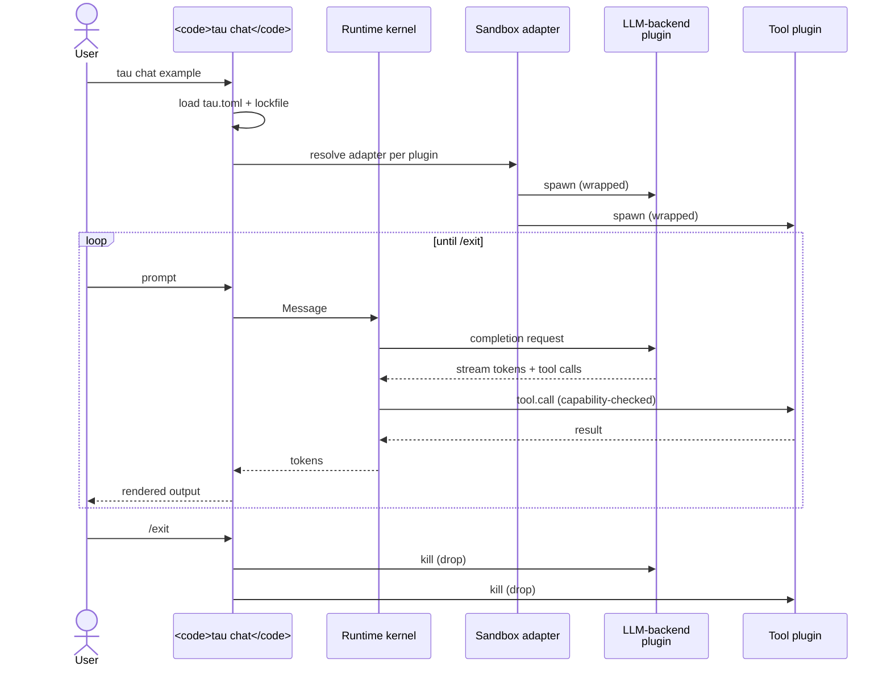

# Bootstrap a tau project

This tutorial walks through creating a fresh tau project, exploring
the generated `tau.toml`, and understanding how the agent declaration
fits together with packages and capabilities. By the end you will:

- Have a working `tau.toml` in a project directory.
- Understand the `[project]` / `[agents.<id>]` / `[agents.<id>.prompt]`
  layout.
- Know which `tau` verbs to reach for at each step.
- Have a concrete map of what needs to happen between here and a
  running agent.

> **Phase 0 honest framing.** At the time of writing, tau core is
> Phase 1. The five real plugin packages (`anthropic`, `openai`,
> `ollama`, `fs-read`, `shell`) ship as workspace binaries, not as
> publicly-installable git URLs with full manifests. End-to-end
> `tau install <real-llm-backend>` against a hosted URL is not yet
> a tested user flow. This tutorial focuses on the part of the flow
> that *is* working today (`tau init`, project layout, agent
> declarations) and shows you how to inspect the rest with the CLI.
> See `ROADMAP.md` for plugin-distribution status.

## Step 1: scaffold the project

Pick (or create) a directory and run:

```bash
mkdir my-project && cd my-project
tau init
```

You'll see:

```
created /path/to/my-project/tau.toml
hint: add `.tau/` to your .gitignore
```

`tau init` is idempotent only on first run; a subsequent call without
`--force` errors out with `tau.toml already exists`. Add `--dry-run`
to preview the file without writing.

The hint matters: tau-pkg installs packages into the project's
`.tau/` directory as machine-local state (per ADR-0004 §6). Treat
it like `node_modules/` or `target/` — gitignore it.

## Step 2: read the scaffolded `tau.toml`

Open `tau.toml`:

```toml
[project]
name = "my-project"

[agents.example]
display_name = "Example Agent"
package      = ""
llm_backend  = ""

[agents.example.prompt]
system = """
You are an example agent. Edit this prompt to give yourself a job.
"""
```

Three blocks, three layers:

### `[project]`

Identifies the project. Just a name today; more fields land as the
project model grows. The name doesn't need to be unique across the
internet — it's a local label.

### `[agents.<id>]`

Each agent the project knows about appears as a sub-table under
`[agents.<id>]`. The id (`example` here) is what you pass to
`tau run` and `tau chat`:

```bash
tau chat example      # start an interactive REPL with this agent
tau run example "..." # one-shot
```

Two fields are load-bearing:

- `package` — a git URL pointing at the agent's package. The
  package's manifest declares the agent's default capabilities,
  default LLM backend, default system prompt. Today, with no
  published-package ecosystem, you'd typically point this at a
  local `file://` URL during development.
- `llm_backend` — the package providing the model. Either a git URL
  or, if the agent's package declares one, an explicit override.

The example scaffold leaves both empty so `tau chat example` fails
loudly with "package must be non-empty" instead of silently picking
something. The intent is *you*, the project author, set these.

### `[agents.<id>.prompt]`

The agent's system prompt. Two mutually-exclusive forms:

```toml
[agents.example.prompt]
system = "..."

# or

[agents.example.prompt]
system_file = "prompts/example.md"
```

Setting both surfaces `PromptAmbiguous` at load. The `system` form
is convenient for short prompts; `system_file` keeps long prompts
out of `tau.toml` and lets you put them under version control as
plain Markdown.

## Step 3: discover the CLI

Before wiring up an actual agent, get a feel for what `tau` can do.
`--help` lists every verb:

```bash
tau --help
```

The ones you'll reach for first:

| Verb | Purpose |
|---|---|
| `tau init` | scaffold a `tau.toml` (you just used this) |
| `tau install <url>` | install a package from a git URL into the active scope |
| `tau list` | show installed packages |
| `tau resolve` | re-derive the lockfile from `tau.toml` |
| `tau chat <agent-id>` | interactive REPL with the agent |
| `tau run <agent-id> "<prompt>"` | one-shot invocation |
| `tau verify` | check installed packages match the lockfile (content hashes) |
| `tau plugin describe <name>` | low-level: show a plugin's declared capabilities |
| `tau sandbox probe` | show which sandbox adapters are available on this host |

Each verb has its own `--help`. `tau install --help` lists the
flags (`--global`, `--dry-run`, `--force`, `--yes`).

## Step 4: explore your scope

Even with no agents wired up, your project now has a scope:

```bash
ls -la .tau/   # nothing yet
tau resolve    # creates .tau/ and the empty lockfile
```

`tau resolve` is the verb that turns `tau.toml`'s declarations into
a concrete lockfile. It clones every declared `package` /
`llm_backend` source, walks dependencies, and writes
`.tau/lockfile.toml` + `.tau/config.toml`. Today, with empty
`package` fields, it will fail with a guided error — that's
expected. It tells you exactly what `tau.toml` field is missing.

When you do have a working source URL, the lockfile is what tau
actually reads at run time. `tau.toml` declares intent; the
lockfile is the resolved truth, hashed and version-pinned.

## Step 5: understand the agent loop (conceptual)



Here's what would happen on a fully-wired `tau chat example`:

1. **Load `tau.toml`**: parse `[agents.example]`.
2. **Resolve**: read the lockfile, locate the agent's package and
   LLM backend.
3. **Sandbox-check**: for each plugin involved, pick an adapter
   (`native` / `darwin` / `container` / `passthrough`) per the
   tier model.
4. **Spawn plugins**: the LLM backend and any tool plugins spawn
   as subprocesses under the chosen sandbox adapter.
5. **REPL**: each user prompt becomes a `Message`, sent to the
   kernel, which routes to the LLM backend, processes the
   response (tool calls are dispatched, capabilities are
   checked), and streams tokens back.
6. **Shutdown**: on `/exit` or Ctrl-D the runtime drops, plugin
   processes are killed.

The whole loop is exercised end-to-end in
`crates/tau-cli/tests/cmd_chat*.rs` using the in-repo `echo-llm`
plugin (a toy backend that replays canned responses). That test
suite is the executable reference for the lifecycle described
above.

## Where to go next

You now know the shape. The natural next directions:

- **Want to write a reusable behaviour for an agent?** Read
  [Build your first skill](build-your-first-skill.md) — a complete
  worked tutorial that ships an end-to-end working artifact.
- **Want to harden the project before you wire it up?** Read
  [Configure the sandbox tier](../how-to/configure-sandbox-tier.md).
- **Want to understand why the model has this shape?** Read
  [Packages](../explanation/packages.md) and
  [Capabilities and consent](../explanation/capabilities-and-consent.md).
- **Tracking what's shipping?** `ROADMAP.md` at the repo root.

## Reference

- [`CONSTITUTION.md`](../../CONSTITUTION.md) — G1–G17 explain why the
  project / agent / package separation is the way it is.
- [Packages](../explanation/packages.md) — the package model the
  `package` / `llm_backend` fields point at.
- [Capabilities and consent](../explanation/capabilities-and-consent.md)
  — what the agent is actually allowed to do once it loads.
- [Sandboxing](../explanation/sandboxing.md) — what happens between
  spawn and run.
